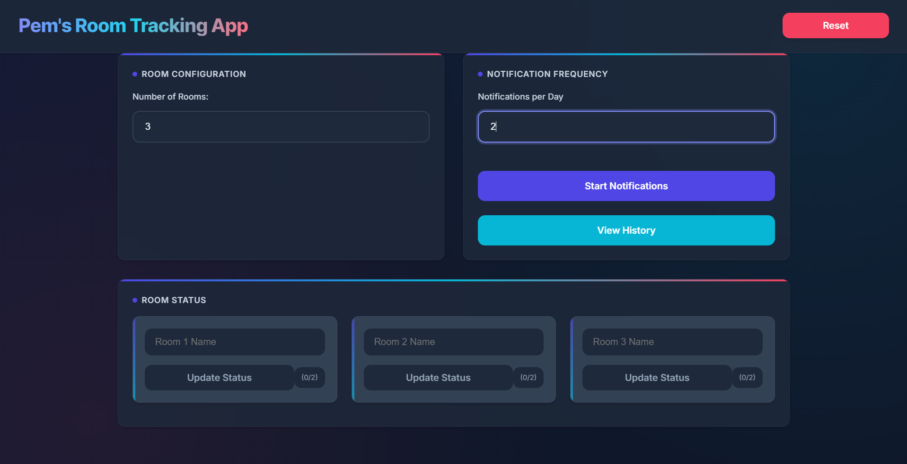

# Pem's Room Tracking App

## Overview
Pem's Room Tracking App is a React application built with Vite that helps users manage and track the organization of their rooms. The app allows users to input the number of rooms, track their organization status, and view history logs of room organization checks.

 <!-- Replace with actual screenshot link -->

## Key Features

### Room Management
- Add and manage multiple rooms.

### Organization Tracking
- Check if rooms are organized and provide reasons if not.

### History Logs
- View the history of room organization checks.

### Responsive Design
- Works well on both desktop and mobile devices.

## Technologies Used
- **React**: A JavaScript library for building user interfaces.
- **Vite**: A fast build tool and development server.
- **React Modal**: For displaying modal dialogs.
- **ESLint**: For linting JavaScript code.

## Installation
To get started with the project, follow these steps:

1. **Clone the repository**:
   ```bash
   git clone https://github.com/yourusername/pems-room-tracking-app.git
   cd pems-room-tracking-app
   ```

2. **Install dependencies**:
   ```bash
   npm install
   ```

3. **Run the development server**:
   ```bash
   npm run dev
   ```

4. **Open your browser** and navigate to `http://localhost:5173` to view the app.

## Usage
- **Add Rooms**: Use the input field to specify the number of rooms you want to manage.
- **Check Organization**: For each room, you can check if it is organized and provide a reason if it is not.
- **View History**: Access the history of organization checks to see past entries.

## Project Structure
```
pem-room-tracking-app/
├── public/
│   └── index.html
├── src/
│   ├── images/
│   │   ├── screenshot.png
│   ├── components/
│   │   ├── Header.jsx
│   │   ├── RoomForm.jsx
│   │   ├── RoomList.jsx
│   │   ├── OrganizationModal.jsx
│   │   ├── HistoryModal.jsx
│   │   └── NotificationSettings.jsx
│   ├── styles/
│   │   ├── Header.css
│   │   ├── RoomForm.css
│   │   ├── RoomList.css
│   │   ├── OrganizationModal.css
│   ├── App.jsx
│   ├── main.jsx
│   ├── index.css
│   └── App.css
├── .gitignore
├── package.json
├── README.md
└── vite.config.js
```

## Contributing
If you would like to contribute to this project, please fork the repository and submit a pull request. Any contributions are welcome!
